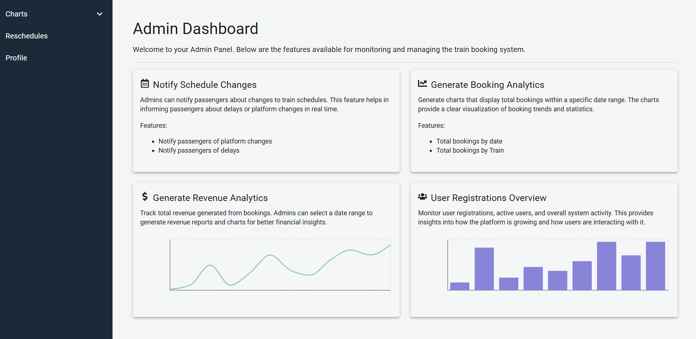

# TrainEase - Admin Panel

The TrainEase Admin Panel is a powerful platform that helps administrators manage tasks easily. It has a secure login system and a user-friendly interface, letting admins use charts to see bookings, revenue, and user registrations for a chosen time period. The dashboard also allows quick rescheduling of trains and ensures passengers are promptly notified of any changes through email.


<div style="display: flex; flex-wrap: wrap; justify-content: space-around;">
    
</div>

## Features

- **Admin Login and Dashboard Overview:** Provides a secure login system for administrators. Once logged in, admins access the central dashboard, which serves as the main hub for managing tasks and monitoring system activities with a clean, user-friendly interface.
  

- **Charts and Analytics (Bookings, Revenue, and User Registrations):** The analytics section offers real-time data visualization through line and bar charts, allowing admins to track key metrics like all bookings or bookings for a specific train, revenue, and user registrations. Charts can be filtered by specific date ranges for detailed analysis.

- **Train Rescheduling and Notifications:** Allows admins to reschedule trains due to maintenance or other operational changes. The system enables time and platform modifications and automatically notifies all affected passengers via email about the updated schedule.

- **Sign Out Option:** For added security, admins can log out using the Sign Out option to prevent unauthorized access when stepping away from the device.

## Tech Stack

- **Frontend:** 
  - [React](https://reactjs.org/) - A JavaScript library for building user interfaces.
  - [Vite](https://vitejs.dev/) - A build tool that improves development experience and performance.
  - [Material UI](https://mui.com/) - A popular React component library that provides pre-designed UI components, ensuring a consistent and stylish look throughout the application.

- **Backend:** 
  - [Node.js](https://nodejs.org/) - JavaScript runtime built on Chrome's V8 JavaScript engine.
  - [Express](https://expressjs.com/) - A minimal and flexible Node.js web application framework.

- **Database:** 
  - [MongoDB](https://www.mongodb.com/) - A NoSQL database for flexible document storage.

- **State Management:** 
  - [Redux](https://redux.js.org/) - A predictable state container for JavaScript apps.


## Prerequisites

- **Node.js:** [Download Node.js](https://nodejs.org/) and install it on your machine.
- **npm:** Node Package Manager (npm) is included with Node.js.
- **MongoDB:** Ensure you have MongoDB is installed and running.

## Installation
1. Clone the repository

    ```bash
   git clone https://github.com/DimalshaMadushani/TrainEase-Admin-Panel.git

   cd TrainEase-Admin-Panel
2. Install the dependencies

    ```bash
    yarn install
    OR
   npm install
3. Create an .env file to store environment variables

    ```bash
   VITE_HOST="your-ipv4-address"

4. Start the development server

    ```
    npm run dev
    ```


## Deployment

We built our web application on [Render](https://render.com/) plaform. You can access the live application at [TrainEase-Admin-Panel](https://trainease-admin-panel.onrender.com).